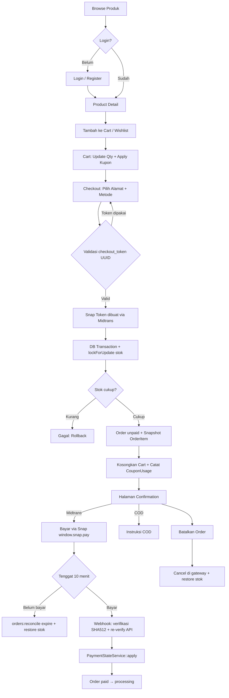
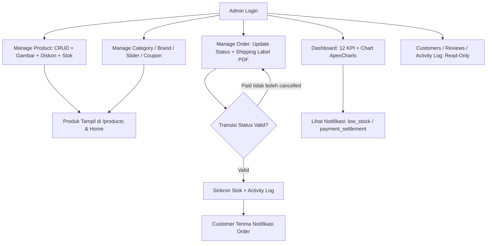
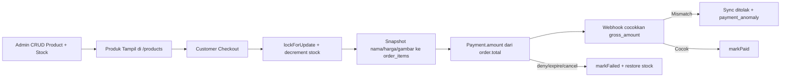

# E-Commerce Complex — Clothes Shop

Aplikasi **e-commerce** berbasis web untuk jual-beli produk (pakaian, elektronik, dll.) dengan keranjang belanja, kupon diskon, review produk, dan pembayaran real via **Midtrans Snap** atau **COD**. Sistem ini memisahkan peran **customer** (pembeli) dan **admin** (pengelola toko), dengan alur belanja dari browsing produk hingga konfirmasi pembayaran dan pencetakan invoice PDF.

Dibangun sebagai project pembelajaran/portfolio dengan fokus pada payment gateway idempoten (anti double-booking pembayaran), manajemen stok pessimistic locking, dan panel administrasi lengkap.

---

## Tech Stack

| Layer               | Teknologi                                                    |
| ------------------- | ------------------------------------------------------------ |
| Framework           | Laravel 13.19 (PHP ^8.3)                                     |
| Frontend            | Blade + Bootstrap 5 theme (aset statis), Alpine.js           |
| Styling             | Tailwind CSS 3 (PostCSS, halaman guest) + tema Bootstrap     |
| Database            | SQLite (default dev/test), session/cache/queue driver DB     |
| Auth                | Laravel Breeze 2.4 (Blade stack, role-based)                 |
| Payment gateway     | Midtrans Snap (`midtrans/midtrans-php` 2.6, sandbox)         |
| PDF                 | barryvdh/laravel-dompdf (invoice & shipping label)           |
| Validation & forms  | Laravel Form Request, one-time `checkout_token` (UUID)       |
| Charts & utility    | ApexCharts, SweetAlert2, Swiper, jQuery                      |
| Testing             | Pest 4.7 (`pestphp/pest-plugin-laravel`), 97 test            |
| Build tool          | Vite 8 + `laravel-vite-plugin`                               |

---

## Fitur Utama

### Halaman Publik (Tanpa Login)

| Fitur              | Keterangan                                                                                                     |
| ------------------ | -------------------------------------------------------------------------------------------------------------- |
| **Home**           | Slider hero, banner kategori, Hot Deals (diskon aktif), Featured Products, daftar brand                        |
| **Products**       | Katalog dengan filter kategori/brand, sort (harga/nama/terbaru), rating live, pagination 12                    |
| **Live Search**    | Pencarian AJAX debounced di navbar (JSON, limit 8 hasil)                                                       |
| **Product Detail** | Galeri gambar, harga coret diskon, rating, deskripsi, produk terkait, tombol cart/wishlist, form review        |
| **Login/Register** | Breeze auth — register wajib `phone` (regex `08…`), role otomatis `customer`                                   |

### Customer (Login Required)

| Fitur              | Keterangan                                                                                                              |
| ------------------ | ----------------------------------------------------------------------------------------------------------------------- |
| **Dashboard**      | Statistik (Total Orders, Total Spending, Wishlist), Recent Orders, Recent Notifications                                 |
| **Cart**           | Cart DB-backed (`carts`/`cart_items`), update qty (1–1000), subtotal sadar diskon, badge count navbar                   |
| **Wishlist**       | Tambah/hapus produk ke wishlist (guard ownership)                                                                       |
| **Coupon**         | Apply/remove kupon (session) — cek expired, minimum purchase, **1× per user** (`coupon_usages` unique)                  |
| **Checkout**       | Pilih alamat + metode `midtrans\|cod`, validasi one-time `checkout_token`, PPN Rp1.000, Snap token dibuat sebelum transaksi |
| **Payment**        | Tombol **Pay Now** (`window.snap.pay`), polling status tiap 5 detik (gateway sync maks 1×/10 detik)                     |
| **My Orders**      | Daftar order + badge status, detail kwitansi, cancel (belum bayar), reorder, **unduh invoice PDF**                      |
| **Reviews**        | Hanya untuk item order `completed` milik sendiri, 1 review per item                                                     |
| **Addresses**      | CRUD alamat pengiriman                                                                                                  |
| **Profile**        | Edit profil, ganti password, hapus akun                                                                                 |

### Admin (Role `admin`)

| Modul               | Keterangan                                                                                           |
| ------------------- | ---------------------------------------------------------------------------------------------------- |
| **Dashboard**       | 12 kartu KPI (orders, revenue, pending/completed/shipped/canceled ± amount), chart ApexCharts (minggu/bulan/tahun), Revenue Growth %, Best Selling Top 5, Recent Orders |
| **Manage Product**  | CRUD produk (multi-gambar, slug unik, stok, diskon rentang tanggal), search + pagination, alert `low_stock`/`out_of_stock` |
| **Manage Category / Brand / Slider** | CRUD lengkap + upload gambar                                                               |
| **Manage Coupon**   | CRUD kupon (fixed/percent, minimum purchase, expired)                                                |
| **Manage Order**    | Search invoice/nama/phone, update status & payment_status (state machine tervalidasi), **shipping label PDF**, sinkron stok |
| **Customers**       | Daftar customer + search + jumlah order                                                              |
| **Reviews**         | Daftar review + search                                                                               |
| **Activity Log**    | Log aktivitas user/admin + search (retensi 7 hari)                                                   |
| **Notifications**   | Lonceng navbar — order placed/settlement/failed, low/out of stock, payment anomaly (mark read AJAX)  |
| **Settings**        | Edit profil & password admin sendiri                                                                 |

### Manajemen Status Pembayaran

Dua kolom terpisah di `orders`:

- **`payment_status`:** `unpaid` → `pending` → `paid` / `failed` / `challenge`
- **`status` (fulfillment):** `pending` → `processing` → `shipped` → `completed`, atau `cancelled`

Alur yang didukung:

`unpaid/pending` → `paid` (webhook `settlement` / `capture` + `fraud_status=accept`, setelah verifikasi `gross_amount` == `order.total`)

atau `failed` + `cancelled` (webhook `deny`/`cancel`/`expire` — stok otomatis dikembalikan), atau `challenge` (fraud challenge, review manual). Setelah `paid`, replay notification yang menurunkan status **diblokir**; settlement yang masuk setelah order `cancelled` memicu `reapplyStock()` + notifikasi `payment_anomaly`.

---

## Alur Proses Bisnis Sistem

### 1. Alur Customer (Checkout & Pembayaran)



### 2. Alur Admin (Manajemen)



### 3. Alur Data Order & Stok



> **Catatan:** Nama, harga, gambar, kategori, dan merek produk di-*snapshot* ke tabel `order_items` saat checkout, sehingga kwitansi/invoice tetap akurat meskipun produk diedit atau dihapus admin kemudian. Webhook Midtrans memverifikasi `gross_amount` terhadap `order.total` yang sama, dan seluruh transisi status hanya lewat `PaymentStateService::apply()` (row lock + dedupe + guard idempoten).

---

## Kelebihan Project

1. **Anti double-checkout** — `checkout_token` UUID sekali pakai (`hash_equals`) + `lockForUpdate` saat decrement stok; submit ulang dan tab ganda ditolak.
2. **Payment state machine idempoten** — Satu-satunya jalur transisi status: `PaymentStateService::apply()` dalam `DB::transaction` + row lock, `Payment::firstOrCreate` + unique index (dedupe webhook), guard `paid`/`failed` (stok hanya direstok sekali).
3. **Webhook aman** — Signature SHA512 (`order_id+status_code+gross_amount+server_key`) via `hash_equals`, **re-verify payload ke API Midtrans** (payload tidak dipercaya), throttle 30/menit, anti-replay.
4. **Anti-tamper harga** — Total dihitung dari database, `gross_amount` wajib == `order.total` (mismatch → sync ditolak + notifikasi `payment_anomaly`, log max 1×/hari), `Σ item_details` dibulatkan integer agar valid untuk Midtrans.
5. **Rekonsiliasi otomatis** — `orders:reconcile` tiap 5 menit: expire order lewat `MIDTRANS_EXPIRE_MINUTES` (default 10 menit), fallback fabricate payload expire bila 404, sinkron status tertinggal; halaman order polling dengan guard gateway 10 detik.
6. **Role-based access** — `RoleMiddleware` (`role:admin`/`role:customer`), guard ownership checkout/invoice/cancel/reorder/wishlist/review, redirect sesuai `dashboardRoute()`.
7. **Stok konsisten** — Pessimistic locking saat checkout; restore stok pada payment failed/cancel; `reapplyStock()` clamp `max(0,…)` bila settlement datang setelah order dibatalkan; sinkron dua arah saat admin ubah status.
8. **Testing lengkap** — 97 test Pest (34 di antaranya payment: webhook, dedupe, mismatch, reconcile, cancel, checkout) dengan `FakeMidtransService` + helper signature webhook yang sama persis dengan produksi.

---

## Kekurangan & Keterbatasan

1. **Flash message sebagian tidak tampil** — `components/flash.blade.php` ada tetapi belum di-include di layout global; hanya 3 halaman yang me-render inline (cart, admin orders, settings).
2. **Notifikasi customer tidak pernah terisi** — `NotificationService::send()` selalu menulis `user_id = null` (target admin); dashboard customer membaca `$user->notifications()` sehingga selalu kosong.
3. **Tanpa notifikasi email** — `MAIL_MAILER=log`; order/pembayaran/pembatalan hanya tampil di UI, tidak dikirim via email (verifikasi email Breeze juga tidak dipaksa).
4. **Tanpa integrasi ongkir/kurir** — `shipping_cost` selalu 0, belum ada API kurir; shipping label hanya label sederhana DomPDF.
5. **Tanpa refund otomatis** — order sudah `paid` tidak bisa dibatalkan dari UI; refund dilakukan manual di dashboard Midtrans.
6. **PPN hard-code Rp1.000** — bukan persentase dan belum dikonfigurasi.
7. **Kupon tanpa kuota total** — batasnya hanya 1× per user + minimum purchase + expired; tidak ada `usage_limit` global.
8. **Produk hard delete + halaman read-only** — tanpa soft delete/restore; detail customer, moderasi/hapus review hanya daftar (belum ada aksi).
9. **View placeholder** — `customer/dashboard/account.blade.php` dan `history.blade.php` masih kosong (0 byte); role admin belum ada UI kelola (di-set manual di DB/seeder).

---

## Struktur Folder Penting

```
app/
├── Http/Controllers/
│   ├── Admin/               # Dashboard, Product, Category, Brand, Coupon,
│   │                        # Slider, Order, Customer, Review, Activity, Setting, Notification
│   ├── Customer/            # Home, Product, Search, Cart, Wishlist, Coupon, Address,
│   │                        # Checkout, Order, Invoice, Review, Dashboard, Midtrans (webhook)
│   └── Auth/                # Breeze (9 controller)
├── Http/Middleware/         # RoleMiddleware (role:admin|customer)
├── Models/                  # 21 model (User, Product, Order, Payment, Cart, ...)
├── Services/
│   ├── PaymentStateService.php    # State machine pembayaran idempoten
│   ├── MidtransService.php        # Snap token, status, cancel, expire
│   ├── NotificationService.php    # Notifikasi in-app
│   └── LogActivityService.php     # Activity log
├── Console/Commands/        # ReconcileOrders, CleanOldNotifications, CleanActivityLog
└── helpers.php              # imageUrl()
resources/views/
├── admin/                   # 23 view (dashboard + CRUD)
├── customer/                # 16 view (home, product, cart, checkout, dashboard)
├── components/              # navbar, sidebar, flash, pagination-custom, modal, ...
└── layouts/                 # app (customer), admin, guest (Vite/Tailwind)
database/
├── migrations/              # 28 migrasi (~28 tabel termasuk payments, coupon_usages unique)
├── factories/               # 8 factory
└── seeders/                 # Role, 2 user demo, 5 brand, 5 kategori, 50 produk, 100 review
routes/                      # web.php, auth.php, api.php (webhook), console.php (scheduler)
tests/                       # Pest: 96 Feature + 1 Unit, Support/FakeMidtransService
config/midtrans.php          # Key, snap.js URL, expire_unpaid_minutes
planning/                    # BRIEF.md, ERD.md, diagram, progres.MD
```

---

## Instalasi & Menjalankan Project

### Prasyarat

- PHP >= 8.3 + Composer
- Node.js + npm
- Akun [Midtrans](https://midtrans.com) (mode Sandbox) — Merchant ID + Server Key + Client Key

### Langkah

```bash
# Clone & masuk folder project
cd e-commerce-complex

# Setup penuh: .env + key + migrate --seed + npm install + build
composer run setup
```

Atau manual:

```bash
cp .env.example .env
php artisan key:generate
touch database/database.sqlite
php artisan migrate --seed
npm install
npm run build
```

Isi `.env` (Midtrans memakai nama key non-standar):

```bash
APP_NAME="Clothes Shop"

# Database (SQLite)
DB_CONNECTION=sqlite

# Midtrans (Sandbox)
MERCHANT_ID=
CLIENT_KEY=
SERVER_KEY=
MIDTRANS_EXPIRE_MINUTES=10   # auto-expire order belum bayar (menit)
```

Jalankan server + queue + scheduler + Vite:

```bash
composer run dev
```

Buka browser: `http://localhost:8000`

> **Catatan:** Seeder membuat akun demo — **admin@gmail.com** (role admin) & **customer@gmail.com** (role customer), password `password`. Jalankan `php artisan schedule:work` (atau cron `schedule:run`) agar `orders:reconcile` tiap 5 menit & pembersihan harian aktif.

---

## Route Penting

| URL / Endpoint                         | Deskripsi                                |
| --------------------------------------- | ---------------------------------------- |
| `/`                                     | Homepage (slider, hot deals, featured)   |
| `/products`                             | Katalog (filter + sort + pagination)     |
| `/products/search?q=`                   | Live search JSON (limit 8)               |
| `/products/{product:slug}`              | Detail produk + review                   |
| `/cart`                                 | Keranjang belanja                        |
| `/wishlist`                             | Wishlist                                 |
| `/customer/dashboard`                   | Dashboard customer                       |
| `/customer/checkout`                    | Checkout (GET info, POST buat order)     |
| `/customer/checkout/{invoice}/confirmation` | Halaman bayar (Snap / instruksi COD)  |
| `/customer/orders`                      | Daftar order + kwitansi                  |
| `/customer/orders/{invoice}/payment-status` | Polling status pembayaran (JSON)      |
| `/customer/orders/{invoice}/invoice`    | Unduh invoice PDF                        |
| `/customer/addresses`                   | CRUD alamat                              |
| `/profile`                              | Edit profil / password                   |
| `/admin/dashboard`                      | Panel admin: KPI + chart                 |
| `/admin/products`                       | CRUD produk (+ diskon & gambar)          |
| `/admin/orders`                         | Kelola order + shipping label PDF        |
| `/admin/categories`, `/brands`, `/coupons`, `/sliders` | CRUD masing-masing          |
| `/admin/customers`, `/reviews`, `/activities` | Daftar read-only                   |
| `POST /api/payment/notification`        | Webhook Midtrans (SHA512, throttle 30/mnt) |

---

## Model Relasi (Ringkas)

```
User ──┬── Role (admin | customer)
       ├── Cart ── CartItems ── Products
       ├── Wishlist ── WishlistItems ── Products
       ├── Addresses
       ├── Orders ──┬── OrderItems (snapshot: nama, harga, gambar, brand)
       │            └── Payments (unique: order_id+transaction_id+transaction_status)
       ├── Reviews (per OrderItem, 1×)
       ├── CouponUsages ── Coupons (unique: coupon+user)
       └── ActivityLogs / Notifications

Products ──┬── Category, Brand
           ├── ProductImages
           ├── Discount (rentang tanggal → has_discount)
           └── Reviews (rating dihitung live via withAvg)

Notifications (user_id NULL = untuk admin: order_placed, payment_settlement,
               payment_failed, payment_expired, payment_anomaly,
               low_stock, out_of_stock, new_review, order_cancelled)
```

---

## Roadmap / Pengembangan Lanjutan

- Render flash message global di semua layout
- Notifikasi customer per-user (order status) + lonceng di navbar customer
- Notifikasi email (order, lunas, dibatalkan) + paksa verifikasi email
- Integrasi ongkir/kurir & konfigurasi PPN persentase
- Refund otomatis via API Midtrans
- Kuota total pemakaian kupon (`usage_limit`)
- Soft delete/restore produk + moderasi/hapus review
- Detail customer & riwayat transaksi untuk admin
- Manajemen user/role di panel admin
- Halaman profil & riwayat kosong (`account`, `history`)
- Unit test untuk service (PaymentState, Midtrans) + test CRUD admin

---

## Referensi Desain

Desain UI/UX mengikuti template [Laravel 11 E-Commerce Project](https://github.com/surfsidemedia/Laravel-11-E-Commerce-Project) dari **surfsidemedia** — tema Bootstrap untuk halaman customer (`public/assets`) dan panel admin (`public/admin`), dikombinasikan dengan Laravel Breeze untuk halaman auth.
